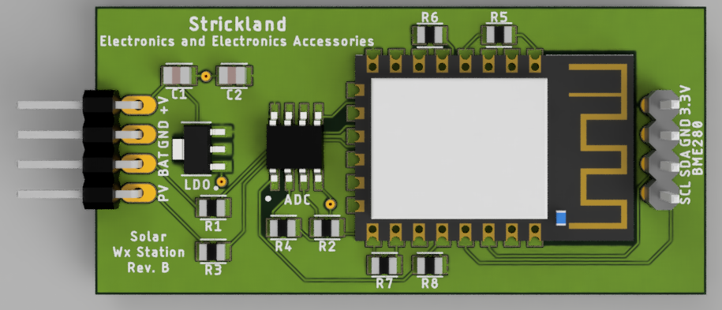

# wxmon
Weather monitor using the ESP12E MCU and BME280 environmental sensor, comprised of an outdoor solar-powered sensor module and an indoor eInk display module. Optimized for low power consumption, draws only ~30μA while sleeping.

## Sensor module

### Progress
- [X] Schematic
- [X] PCB Layout
- [X] Gerber CAM files (zipped up and ready to upload to JLC PCB, OSH Park, etc)
- [ ] Software created using PlatformIO/Arduino - WIP
- [ ] Enclosure STL files

## Display module
### Progress
- [ ] Schematic
- [ ] PCB Layout
- [ ] Gerber CAM files (zipped up and ready to upload to JLC PCB, OSH Park, etc)
- [ ] Software created using PlatformIO/Arduino
- [ ] Enclosure STL files
